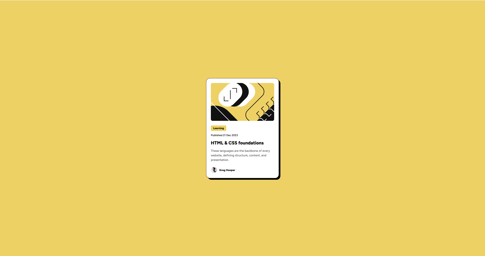

# Blog Preview Card

This is a Blog Preview Card built using HTML and CSS. The project displays a blog preview with an illustration, category, publication date, title, description, and author details in a structured layout.
## Screenshots



## Demo

[View Live Project](https://2-blog-preview-card-ten.vercel.app/)

## Project Structure

```
/blog-preview-card
├── assets/
│   ├── fonts/
│   ├── images/
├── index.html
├── styles.css
├── README.md
```


## Technologies Used

- HTML5
- CSS3
- Flexbox
- Vercel

## Installation & Usage

To run the project locally:

1. Clone the repository:
   ```sh
   git clone https://github.com/austin-jonas/2-blog-preview-card.git
   ```
2. Open index.html in a browser.